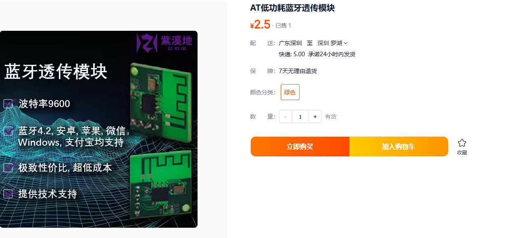

# 微信小程序+低功耗蓝牙控制 说明
实现微信小程序 和单片机控制 参考代码 文件所示
1. 演示地址
https://www.bilibili.com/video/BV1mtz2YmENF/

2. 解析`json`指令 达到控制的目的
## 硬件物料
### 蓝牙透传模块

http://e.tb.cn/h.TdlUU42Ig17eqvz?tk=8G9f3F50SjzMF3543 

这是这个蓝牙模块 可以参考 反正是低功耗蓝牙就行

主要硬件连接

```C
功耗蓝牙透传模块                            MCU

  RX       --------------------------      TX

  TX       --------------------------      RX

  VCC      --------------------------     VCC

  GND      --------------------------     GDN

```
# 参考链接

https://www.bilibili.com/video/BV1HM4m1R7EV/ 

获取更多内容 call me 加我微信进群讨论
`iYoung0813`